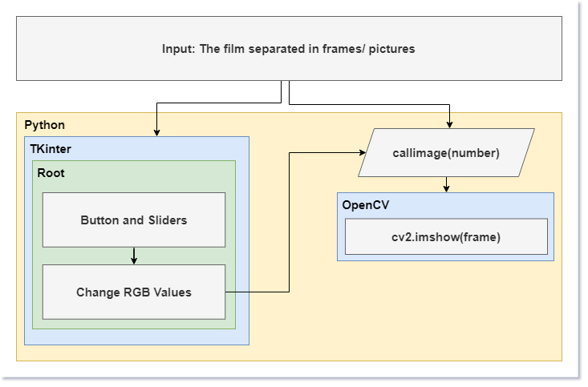

## PES3_Colorimetrie

Github dedicated specifically to the post process of visualization of the images, where the purpose of the code is to be able, mainly to visualize the 9.5mm film, and then to be able to vary both the colorimetry and the contrast and brightness. 

## Usage

For using the main code is `./framePlayer.py` 

## Diagram

## About files

 - application.py: File for all the colorimetry part, the idea is to implement this code in the different players
 - framePlayer.py: File for the reading and change the video as frames
 - videoPlayer.py: File for the reading and change the video as a video itself

 - color folder: Has the frames of a standar RGB Video
 - frames folder: Has the frames of a Black and White Video
 - media folder: Has the diagram image and the original videos

## Client

 - Cinemateque de Bretagne

## Team

 - Team 13: Visionneuse Numérique - Optique et programmation